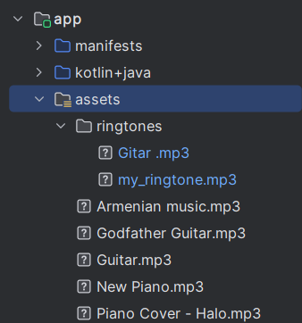

# RingtoneSmartKit

A Kotlin library for easy ringtone management on Android, supporting multiple ringtone sources and providing a simplified API that does not require passing Context or Activity.


## Features

- Simplified API for setting system and contact ringtones without needing to pass Context or Activity.
- Supports multiple ringtone sources, including assets, local storage (URI), and remote URLs.
- Easy assignment of ringtones to specific contacts via different contact identifiers (ID, URI, phone number).
- Asynchronous operations with success and error callbacks for better control.
- Supports setting different types of system ringtones: call, notification, and alarm.
- Fully written in Kotlin with idiomatic usage and extension-friendly design.


## Installation

Add the following dependency to your `build.gradle` or `build.gradle.kts` file:

<details>
<summary>Gradle Groovy (build.gradle)</summary>

```groovy
implementation "io.github.amjdalhashede:ringtone-smart-kit:1.0.2-alpha"
```

</details>

<details>
<summary>Gradle Kotlin DSL (build.gradle.kts)</summary>

```kotlin
implementation("io.github.amjdalhashede:ringtone-smart-kit:1.0.2-alpha")
```

</details>

## Usage

### Setting a system ringtone

```kotlin
RingtoneHelper.setSystemRingtone(
    source = RingtoneSource.FromAssets("ringtones/my_ringtone.mp3"),
    type = RingtoneType.CALL,
    onSuccess = {
        println("System ringtone set successfully")
    },
    onError = { error ->
        println("Failed to set system ringtone: \${error.message}")
    }
)
```

### Setting a ringtone for a specific contact

```kotlin
val contact = ContactIdentifier.ByPhone("+1234567890")

RingtoneHelper.setContactRingtone(
    source = RingtoneSource.FromUrl("https://example.com/ringtone.mp3"),
    contact = contact,
    onSuccess = {
        println("Contact ringtone set successfully")
    },
    onError = { error ->
        println("Failed to set contact ringtone: \${error.message}")
    }
)
```

### Applying ringtone to any target

```kotlin
val target = RingtoneTarget.Contact(ContactIdentifier.ById(42))

RingtoneHelper.applyToTarget(
    source = RingtoneSource.FromAssets("another_ringtone.mp3"),
    target = target,
    onSuccess = { println("Ringtone applied successfully") },
    onError = { error -> println("Error applying ringtone: \${error.message}") }
)
```

### Setting ringtone via interactive contact picker

You can allow users to select a contact interactively without passing ID or phone manually:

```kotlin
RingtoneHelper.setContactRingtone(
    source = RingtoneSource.FromAssets("ringtones/my_ringtone.mp3"),
    contact = ContactIdentifier.Interactive,
    onSuccess = { println("Contact ringtone set successfully") },
    onError = { error -> println("Failed to set contact ringtone: ${error.message}") }
)
```




### Applying ringtone from local storage (Coming soon)

This feature will allow you to set ringtones from local storage URIs.

```kotlin
val source = RingtoneSource.FromStorage(Uri.parse("content://media/internal/audio/media/10"))
// Usage will be similar to other methods
```


## Contributing

Contributions are welcome and appreciated!  
If you find a bug, have a feature request, or want to improve the code/documentation, feel free to:

- Open an issue
- Create a pull request
- Suggest enhancements

Please make sure your changes follow the current code style and include proper documentation or tests when applicable.

---

## Contact

If you have suggestions, questions, or feedback, feel free to reach out:

- Open an issue on [GitHub](https://github.com/AmjdAlhashede/RingtoneSmartKitProject/issues)
- Contact me directly via [GitHub Profile](https://github.com/AmjdAlhashede)
- Or send an email to: **amjdalhashede@gmail.com**


## Availability

This library is available via:

📦 [Maven Central](https://central.sonatype.com/artifact/io.github.amjdalhashede/ringtone-smart-kit): Easy integration using Gradle/Maven.  
🐙 [GitHub Packages](https://github.com/AmjdAlhashede/RingtoneSmartKitProject/packages): Published to the GitHub repository packages as an alternative.
- 💻 **GitHub Repository**: Source code, examples, and documentation are available here:
  [https://github.com/AmjdAlhashede/RingtoneSmartKitProject](https://github.com/AmjdAlhashede/RingtoneSmartKitProject)


## License

Copyright 2025 Amjd Alhashede

Licensed under the Apache License, Version 2.0 (the "License");  
you may not use this file except in compliance with the License.  
You may obtain a copy of the License at:

[http://www.apache.org/licenses/LICENSE-2.0](http://www.apache.org/licenses/LICENSE-2.0)

Unless required by applicable law or agreed to in writing, software  
distributed under the License is distributed on an "AS IS" BASIS,  
WITHOUT WARRANTIES OR CONDITIONS OF ANY KIND, either express or implied.  
See the License for the specific language governing permissions and  
limitations under the License.


